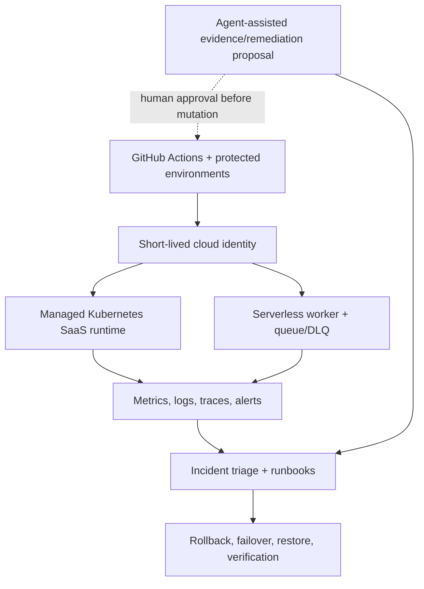

# ContinuityOps — Cloud Reliability and Recovery Platform

> A governed cloud-operations lab that moves an immutable workload through
> protected GitHub OIDC delivery, managed Kubernetes and serverless contracts,
> correlated observability, reproducible incident drills, and verified recovery
> **fixtures** — with agentic remediation proposals behind a protected gate.

**Current claim level: L1** (contracts, fixtures, and synthetic drills). Synthetic L2
where local tools exist. **No L4+ live cloud apply.**

## Results at a glance

| Result | Verified outcome | Evidence |
| --- | --- | --- |
| Delivery / hosted CI stubs | L1 contracts + workflow pins | [S1](evidence/slices/S1/) |
| Kubernetes | Helm chart + synthetic failure matrix | [S2](evidence/slices/S2/) |
| Serverless | Queue/DLQ/idempotency unit contracts | [S3](evidence/slices/S3/) |
| Observability | Telemetry/SLO + synthetic signal path | [S4](evidence/slices/S4/) |
| Operations / drills | Runbooks + 8 synthetic drills | [S5](evidence/slices/S5/) |
| Security / Azure / agentic | Least-privilege fixtures + human gate | [S6](evidence/slices/S6/) |
| Recovery / perf / FinOps | Synthetic restore + before/after + dry-run teardown | [S7](evidence/slices/S7/) |
| Portfolio gate | Claims matrix + recruiter front | [S8](evidence/slices/S8/) |

## Explicit non-claims

- No live EKS / Lambda / Azure apply (not L4+)
- No live production incident drills
- No measured live RTO/RPO
- No live teardown of cloud resources executed
- No ExpressRoute depth; Azure governance is designed/static
- SBOM is a stub (not a live scanner result)

## Architecture

ContinuityOps separates agentic code construction from live cloud authority.
Protected GitHub Actions OIDC is the intended cloud control plane; agent-assisted
remediation has **no default mutation authority** and routes changes through a
protected environment gate (placeholders retained under D-044).

- [Editable draw.io source](docs/architecture/continuityops.drawio)
- [Architecture render](docs/architecture/continuityops-architecture.png)
- [Vector render](docs/architecture/continuityops-architecture.svg)
- [Claims matrix](docs/claims/matrix.json) · [Evidence index](docs/evidence-index.md)
- [Operator entry points](docs/operator/README.md) · [Interview handoff](docs/handoff/interview-walkthrough.md)

## What this repository is

ContinuityOps is a production-style cloud operations capstone. It does not
rewrite upstream work:

- **Project A** (`nathanielecon/cloud`) — infrastructure and governance reference
- **Project C** (`nathanielecon/project-c-cloud`) — application and delivery reference
- **ContinuityOps** — runtime operations: Kubernetes, serverless, observability,
  incidents, recovery, security ops, agent-assisted GitHub workflows, performance,
  and cost control

## Start here (builders)

1. [`PLAN.md`](PLAN.md) — task authority (authorized through Phase 8; D-044)
2. [`docs/operator/README.md`](docs/operator/README.md) — safe one-command checks
3. [`EVIDENCE_AND_CLAIMS.md`](EVIDENCE_AND_CLAIMS.md) — claim vocabulary
4. `node --test tests/` — deterministic local suite

## Claim-safe bullets (recruiter)

- End-to-end **contracts** for k8s, serverless, observability, incidents, recovery
- Honest **L1** evidence with explicit remaining boundaries on every gate
- Agentic remediation = evidence gather + proposal; mutation gated
- FinOps budgets/tags + teardown **inventory dry-run** (no live destroy)
