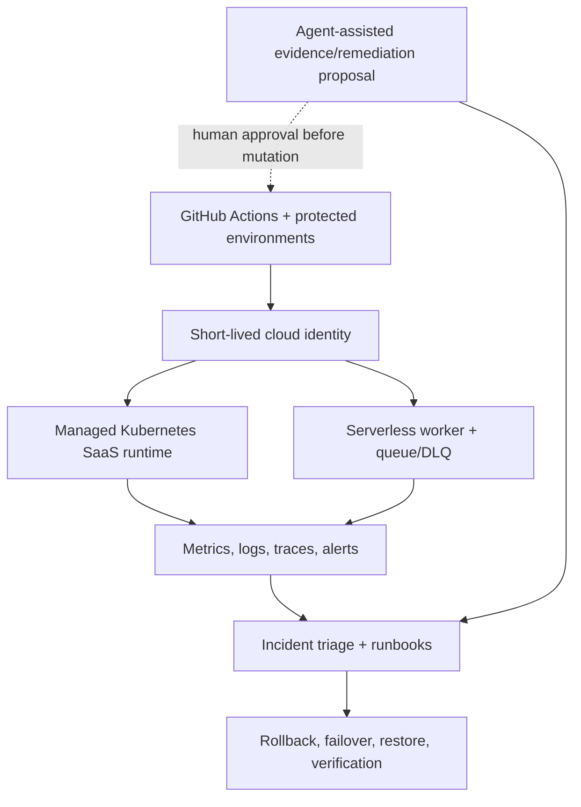

# ContinuityOps — Cloud Reliability and Recovery Platform

> A governed cloud-operations lab that will move an immutable workload through
> protected GitHub OIDC delivery, managed Kubernetes and serverless runtime,
> correlated observability, reproducible incidents, and verified recovery.
>
> **Current evidence level:** planning and repository bootstrap only. No
> Kubernetes, serverless, recovery, or production claims are verified yet.

## Results at a glance

| Result | Verified outcome | Evidence |
| --- | --- | --- |
| Delivery | Not yet verified | — |
| Kubernetes | Not yet verified | — |
| Serverless | Not yet verified | — |
| Operations | Not yet verified | — |
| Recovery | Not yet verified | — |
| Performance/Cost | Not yet verified | — |

Replace rows only when commit-bound evidence IDs exist in the [evidence index](docs/evidence-index.md).

## Architecture

ContinuityOps separates agentic code construction from live cloud authority.
Opus supervises the program; Grok-controlled Ralphy streams coordinate bounded
work; Codex CLI Cloud Agents implement; protected GitHub Actions OIDC performs
approved cloud changes. The target runtime combines managed Kubernetes with a
queued serverless path. Metrics, logs, and traces drive SLO alerts, incident
runbooks, and recovery verification. Agent-assisted remediation has no default
mutation authority and routes changes through a protected human gate.

- [Editable draw.io source](docs/architecture/continuityops.drawio)
- [Architecture render](docs/architecture/continuityops-architecture.png)
- [Vector render](docs/architecture/continuityops-architecture.svg)
- [Full master plan](docs/planning/MASTER_PLAN.md)

## What this repository is

ContinuityOps is a production-style cloud operations capstone. It does not
rewrite upstream work:

- **Project A** (`nathanielecon/cloud`) — infrastructure and governance reference
- **Project C** (`nathanielecon/project-c-cloud`) — application and delivery reference
- **ContinuityOps** — runtime operations: Kubernetes, serverless, observability,
  incidents, recovery, security ops, agent-assisted GitHub workflows, performance,
  and cost control

This repository currently holds the authoritative plan, agent contracts, and
architecture source. Implementation and certification follow Phase 0 in
[`PLAN.md`](PLAN.md).

## Start here (builders)

1. [`docs/planning/MASTER_PLAN.md`](docs/planning/MASTER_PLAN.md) — scope, phases, exit criteria
2. [`docs/planning/RALPHY_ORCHESTRATION.md`](docs/planning/RALPHY_ORCHESTRATION.md) — before any agentic loop
3. [`PLAN.md`](PLAN.md) — task authority (authorized through Phase 0 only)
4. [`AGENTS.md`](AGENTS.md) and [`EVIDENCE_AND_CLAIMS.md`](EVIDENCE_AND_CLAIMS.md) — contracts
5. [`docs/planning/JUDGE_RUBRICS.md`](docs/planning/JUDGE_RUBRICS.md) — freeze before slice work
6. Append failures to [`BREAK_FIX_LOG.md`](BREAK_FIX_LOG.md)

## Five-minute recruiter demo

Not available yet. When Phase gates pass, the demo will be credential-free and
non-mutating: evidence index → hosted check → one blocked unsafe change → one
incident timeline → one before/after recovery or performance result.

## Evidence map

- [Evidence index](docs/evidence-index.md)
- [Hosted delivery](evidence/hosted/)
- [Slice evidence](evidence/slices/)
- [Post-build certification](evidence/postbuild/)
- [Judge councils](evidence/judges/)
- [Break/fix history](BREAK_FIX_LOG.md)
- [Planning package](docs/planning/)

## Technology (planned)

| Layer | Technology |
| --- | --- |
| Cloud/IaC | AWS (isolated lab), Terraform, GitHub OIDC |
| Runtime | EKS, Helm, Kubernetes, serverless, queue/DLQ |
| Delivery | GitHub Actions, immutable digest promotion |
| Observability | Metrics, logs, traces, SLO alerts |
| Security | IAM/RBAC, secrets discipline, policy gates, human-gated agents |
| Verification | Deterministic validators, incident drills, saved/fresh judge councils |

Populate only technology that is present and verified.

## Key decisions and tradeoffs

1. **GitOps over Cloud Agent credentials:** live changes use protected OIDC;
   agents edit source but are not the cloud apply identity.
2. **Concurrent but disjoint:** up to three Ralphy streams; sequential ownership
   inside each stream; integration queue serializes merges.
3. **Saved repair, fresh certification:** continuity accelerates repair; fresh
   judges limit anchoring.
4. **Evidence before claims:** every resume statement maps to a commit-bound
   evidence ID.
5. **Synthetic lab boundaries:** recovery depth without implying sustained
   customer-production ownership.

## Claim boundary

ContinuityOps is an isolated synthetic-data cloud lab. Creating this repository
and planning package proves only that a detailed execution plan exists. It does
**not** prove Kubernetes, serverless, SaaS, incident-response, recovery, Azure,
AWS, GitHub-hosted, or production behavior. Those claims become eligible only
through the evidence levels in [`EVIDENCE_AND_CLAIMS.md`](EVIDENCE_AND_CLAIMS.md).
