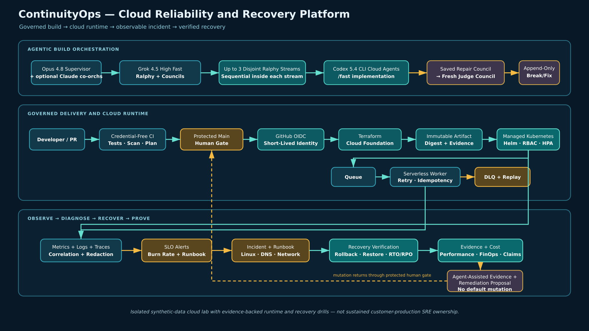
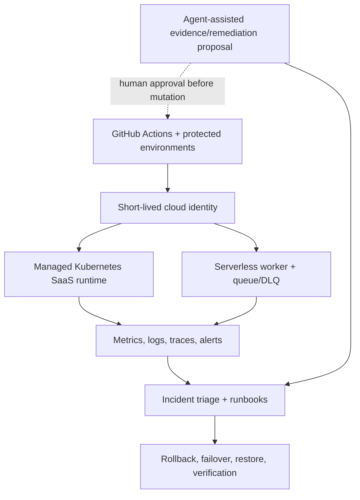

# ContinuityOps — Cloud Reliability and Recovery Platform

> A governed cloud-operations lab that moves an immutable workload through
> protected GitHub OIDC delivery, managed Kubernetes and serverless contracts,
> correlated observability, reproducible incident drills, and verified recovery
> **fixtures** — with agentic remediation proposals behind a protected gate.

**Current claim ceiling: scoped AWS lab L4** via GitHub OIDC → `continuityops-gha`
(apply + lab drill/RTO + teardown). Component ceilings under engagement A3:
security-sbom **L2**, agentic-workflow **L3**, upstream-integration **L2**,
performance **L1**, Azure live **out** (D-046). See [`docs/claims/matrix.json`](docs/claims/matrix.json).

[-teal)](OPERATING_STATE.md)

## Results at a glance

| Result | Verified outcome | Evidence |
| --- | --- | --- |
| Delivery / hosted CI + Terraform | Scoped L4 lab apply via OIDC (`continuityops-gha`) | [S1](evidence/slices/S1/) · [hosted](evidence/hosted/) |
| Kubernetes | Chart contracts + lab EKS apply/teardown | [S2](evidence/slices/S2/) · [elevation](evidence/hosted/cloud-apply-staging-elevation-2026-07-18.json) |
| Serverless | Queue/DLQ contracts + lab Lambda/SQS apply | [S3](evidence/slices/S3/) · [elevation](evidence/hosted/cloud-apply-staging-elevation-2026-07-18.json) |
| Observability | Telemetry/SLO + lab CloudWatch signals | [S4](evidence/slices/S4/) |
| Operations / drills | Runbooks + lab incident drill (not production) | [S5](evidence/slices/S5/) · [drill](evidence/hosted/lab-drill-rto-29645042815.json) |
| Security / Azure / agentic | SBOM L2 · Azure L1 (no live) · agentic L3 hosted-control | [S6](evidence/slices/S6/) |
| Recovery / perf / FinOps | Lab RTO + teardown L4; performance honest L1 | [S7](evidence/slices/S7/) |
| Portfolio gate | A3-scoped matrix + tip-bind + recruiter front | [S8](evidence/slices/S8/) · [tip-bind](evidence/portfolio/tip-bind-2026-07-20.json) · [tipbound S0–S8](evidence/portfolio/tipbound-s0-s8-aa01454.json) |

## Explicit non-claims

- No **production** (customer) incident drills — lab drills only
- No CursorCloudAgent / in-pod AWS credentials (OIDC control plane by design)
- No live **Azure** apply — ContinuityOps AWS-lab ceiling (D-046)
- No ContinuityOps known-good rollback digest proven
- Performance remains **L1** (no live load proof)
- Azure governance is designed/static (no ExpressRoute depth)
- Hosted lab apply/drill/teardown evidence is tip-inherited from recorded runs (not re-applied on every tip)

## Architecture

ContinuityOps separates agentic code construction from live cloud authority.
Protected, manually dispatched GitHub Actions OIDC is the cloud control plane; agent-assisted
remediation has **no default mutation authority** and routes changes through a
protected environment gate (placeholders retained under D-044).

- [Editable draw.io source](docs/architecture/continuityops.drawio)
- [Architecture render](docs/architecture/continuityops-architecture.png)
- [Vector render](docs/architecture/continuityops-architecture.svg)
- [Claims matrix](docs/claims/matrix.json) · [Evidence index](docs/evidence-index.md)
- [Operator entry points](docs/operator/README.md) · [Interview handoff](docs/handoff/interview-walkthrough.md)

## What this repository is

ContinuityOps is a production-style cloud operations capstone. It does not
rewrite upstream work:

- **AWS Landing Zone Lab** (`nathanielecon/aws-landing-zone-lab`) — infrastructure and governance reference
- **Local-First Governed CI/CD** (`nathanielecon/local-first-governed-cicd`) — application and delivery reference
- **ContinuityOps** — runtime operations: Kubernetes, serverless, observability,
  incidents, recovery, security ops, agent-assisted GitHub workflows, performance,
  and cost control

## Start here (builders)

1. [`PLAN.md`](PLAN.md) — task authority (authorized through Phase 8; D-044)
2. [`docs/operator/README.md`](docs/operator/README.md) — safe one-command checks
3. [`EVIDENCE_AND_CLAIMS.md`](EVIDENCE_AND_CLAIMS.md) — claim vocabulary
4. `node --test tests/` — deterministic local suite

## Claim-safe bullets (recruiter)

- End-to-end **contracts** plus scoped **AWS lab L4** proof via GitHub OIDC
- Honest **A3 ceilings** in the claims matrix (Azure out; performance L1; SBOM L2; agentic L3)
- Agentic remediation = hosted-control evidence + proposal; no in-pod AWS credentials
- Lab drill/RTO + teardown evidenced; no production drills; no known-good rollback claim

> Three independent, evidence-backed cloud engineering labs; presented as a reinforcing portfolio, not a claim of one sustained customer-production platform.

## License

Apache-2.0. See [`LICENSE`](LICENSE).
