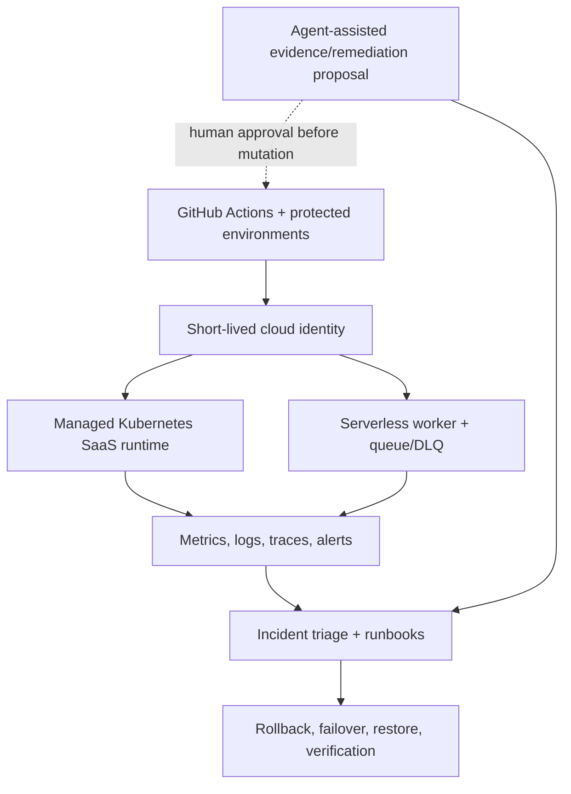

# ContinuityOps Master Plan

Plan ID: `continuityops-cloud-reliability-v1`  
Initial status: `candidate-specification`  
Former code name: `Project F`  
Primary delivery model: concurrent disjoint Ralphy streams followed by
post-build logical repartition and saved-council/fresh-council certification  
Primary cloud: AWS isolated single-account lab  
Azure posture: implemented governance/network companion only where separately
authorized and evidenced

## 1. Outcome

Build and prove an end-to-end cloud reliability and recovery platform around an
existing containerized SaaS application. The finished portfolio should show
that its operator can:

- consume pre-existing infrastructure and release artifacts without rewriting
  them;
- run a service on managed Kubernetes;
- operate an event-driven serverless path;
- define and measure SaaS service levels;
- observe symptoms through metrics, logs, traces, dashboards, and alerts;
- diagnose Linux, application, DNS, TLS, load-balancer, routing, security-rule,
  Kubernetes, and dependency failures;
- choose among rollback, remediation, restart, failover, restore, and rebuild;
- test recovery objectives instead of documenting them only;
- enforce least privilege, secret discipline, policy gates, protected
  environments, and safe agentic automation;
- load-test, right-size, budget, and safely tear down the lab;
- produce evidence-backed incident reports, runbooks, postmortems, change
  records, and portfolio claims.

The project is a lab-grade operations platform. It must not imply enterprise
production tenure, 24/7 customer ownership, multi-account production, or Azure
networking depth that was not actually executed.

## 1A. Requested agent operating model

ContinuityOps uses a layered, cloud-oriented agent topology:

- one Claude Opus 4.8 cloud agent acts as portfolio supervisor;
- the supervisor may appoint Claude Sonnet or Opus cloud co-orchestrators;
- Grok 4.5 High Fast is the default Ralphy orchestrator, judge, nixer, fixer,
  and bottleneck reasoning model;
- Codex 5.4 CLI Cloud Agents in `/fast` mode implement the codebase through
  bounded tasks;
- all worker instructions, status, handoffs, and inter-agent communication are
  Simplified Chinese only;
- all recruiter-facing repository artifacts remain English.

Claude agents are cloud-only. They may use pinned `pxpipe-proxy@0.9.0` with
`ANTHROPIC_BASE_URL=http://127.0.0.1:47821` after integrity, policy, credential,
and fallback checks. The reported 2–3× quota effect is a hypothesis to measure,
not a guaranteed plan assumption.

The lead orchestrator must provision bottleneck subagents for auth, CI, cloud
identity, Kubernetes, observability/dashboard, browser, or toolchain stalls in
the same supervisory session. A blocker must not be handed back as “start a new
conversation” while a safe specialist dispatch exists.

Where TypeScript is used, pin stable TypeScript 7.x; the initial verified
baseline is `typescript@7.0.2`. Use strict checking and full affected-partition
revalidation for any compiler change.

## 2. Upstream preservation contract

### Project A

Project A remains independently complete. ContinuityOps may consume only a
pinned, documented export contract:

- network identifiers and intended connectivity boundaries;
- IAM/OIDC role interfaces;
- audit/log destinations;
- Terraform state/output interfaces;
- naming, tagging, and governance policies;
- verified single-account lab evidence where it remains current.

No ContinuityOps task edits Project A. If an export is absent, create a
ContinuityOps-side adapter or record a blocking integration gap. Do not silently
change A or claim its multi-account design was deployed.

### Project C

Project C remains independently complete. ContinuityOps may consume only a
pinned release contract:

- immutable image digest and registry location;
- application version and Git commit identity;
- liveness/readiness/version/business smoke endpoints;
- configuration and secret interfaces;
- delivery evidence and known-good rollback target when verified.

If Project C has not yet completed immutable digest promotion, append-only
release evidence, authorized Jenkins promotion, or verified rollback, record
that boundary. ContinuityOps may build its own isolated lab release from a
pinned source SHA, but must label it a ContinuityOps lab artifact rather than a
Project C production release.

### Integration manifest

Create `integration/upstreams.lock.json` containing:

```json
{
  "schema_version": "1.0",
  "project_a": {
    "repository": "nathanielecon/cloud",
    "commit_sha": "REQUIRED",
    "consumed_contracts": [],
    "evidence_refs": []
  },
  "project_c": {
    "repository": "nathanielecon/project-c-cloud",
    "commit_sha": "REQUIRED",
    "image_digest": "REQUIRED_OR_EXPLICITLY_UNAVAILABLE",
    "consumed_contracts": [],
    "evidence_refs": []
  }
}
```

Any upstream pin change invalidates integration validation and all downstream
slice evidence.

## 3. Target architecture



### Runtime components

- managed Kubernetes cluster in an isolated lab account/environment;
- Helm release for the Project C-derived application;
- ingress/load balancer, DNS/TLS where an owned test domain is authorized, or a
  documented lab endpoint without invented DNS claims;
- managed database or intentionally lightweight stateful dependency with
  explicit backup and restore boundaries;
- queue plus dead-letter queue;
- serverless event processor demonstrating retries, timeouts, idempotency,
  concurrency, and poison-message handling;
- OpenTelemetry-compatible instrumentation;
- central metrics, logs, traces, dashboards, and actionable alerts;
- GitHub-hosted deployment and evidence workflows using OIDC;
- agent-assisted read-mostly operations workflow with human-gated mutation;
- cost budgets, tags, teardown workflow, and retained post-teardown evidence.

### Environment boundaries

| Environment | Purpose | Mutation authority | Data |
| --- | --- | --- | --- |
| `local` | fast tests, kind/container checks, fault-script development | developer/local agent | synthetic only |
| `staging` | hosted integration and non-destructive incident tests | GitHub OIDC staging role | synthetic only |
| `recovery-lab` | destructive rollback/restore/failure drills | protected GitHub environment + human approval | synthetic seeded dataset |
| `portfolio-demo` | stable read-only demonstration endpoint if retained | protected workflow only | synthetic only |

No task calls an environment `production` unless the repository consistently
uses `lab-production` or `portfolio-demo` and explicitly disclaims customer
production.

## 4. Technology decisions

The implementation may adjust exact managed services during Phase 0 engineering
review, but must preserve the capabilities below.

| Capability | Preferred implementation | Required proof |
| --- | --- | --- |
| Infrastructure | Terraform with remote S3 state, versioning, encryption, lockfile, environment keys | plan/apply identity, state isolation, drift/blocked-change evidence |
| Kubernetes | EKS plus Helm; kind for preflight only | live pod/ingress/autoscaling/failure/recovery evidence |
| Serverless | Lambda + SQS + DLQ | retry, idempotency, poison message, replay, alarm, cost evidence |
| Observability | OpenTelemetry + CloudWatch/managed metrics and trace destination | correlated trace/log/metric path and dashboards |
| CI/CD | GitHub Actions OIDC; Project C artifact contract | pinned actions, protected environments, immutable digest, safe failure demo |
| Security | IAM least privilege, Kubernetes RBAC/network policies, secret manager, scanners/SBOM, policy checks | negative authorization and prohibited-deployment tests |
| Agentic workflow | GitHub workflow that gathers evidence and proposes remediation | no default write authority, approval gate, unsafe proposal rejection |
| Recovery | versioned backups/snapshots plus tested restore | measured RTO/RPO and post-restore business verification |
| Cost | budget/alert, tags, right-sizing, scheduled teardown | cost estimate, actual lab cost snapshot where available, teardown proof |

Use pinned containers or checksums for unstable external scanners/installers.
Do not depend on mutable “latest” installers in a merge gate.

## 5. Repository layout

```text
continuityops/
  .github/workflows/
  app-contract/
  integration/
  terraform/
    bootstrap/
    environments/staging/
    environments/recovery-lab/
    modules/
  kubernetes/
    chart/
    policies/
    scenarios/
  serverless/
  observability/
    dashboards/
    alerts/
    otel/
  operations/
    runbooks/
    incidents/
    postmortems/
    changes/
    drills/
  agentic/
    prompts/
    policies/
    tests/
  tests/
  scripts/
  harness/
    policies/
    rubrics/
    approvals/
  evidence/
    events/
    manifests/
    slices/
  docs/
    architecture/
    decisions/
    reviews/
    claims/
  AGENTS.md
  PLAN.md
  STATUS.md
  ISSUES.md
  DECISIONS.md
  BREAK_FIX_LOG.md
```

## 6. Construction partition and stream strategy

The starting code is treated as a candidate, not as verified merely because it
exists. Phase 0 inventories every file and produces a content-addressed
partition manifest. Each path has exactly one primary slice owner. Shared
interfaces are their own partition and are certified before dependent slices.

| Slice | Owned capability | Representative paths |
| --- | --- | --- |
| S0 | authority, harness, schemas, upstream pins | `PLAN.md`, `scripts/project*`, `harness/`, `integration/` |
| S1 | cloud foundation and delivery integration | `terraform/`, `.github/workflows/`, `app-contract/` |
| S2 | Kubernetes runtime | `kubernetes/`, runtime tests, Helm evidence |
| S3 | serverless and SaaS operating contracts | `serverless/`, tenant/lifecycle docs and tests |
| S4 | observability and SLOs | `observability/`, telemetry tests, dashboards/alerts |
| S5 | incident, Linux, and network operations | `operations/runbooks/`, failure scenarios, diagnostic tooling |
| S6 | security, governance, and agentic workflow | `agentic/`, policies, RBAC/IAM/security evidence |
| S7 | resilience, DR, performance, and FinOps | recovery/load/cost tests and change records |
| S8 | integrated evidence and portfolio delivery | evidence index, claims, final architecture, handoff |

Partition rules:

1. Hash the baseline tree and every partition file list.
2. Freeze a rubric before implementation begins.
3. A task policy lists `allowed_paths` and `adapter_owned_paths`.
4. The adapter alone stages append-only evidence and authoritative state.
5. Cross-partition changes require an interface-change issue and invalidate all
   affected dependent slice certifications.
6. A judge scores the candidate SHA, partition hash, and evidence manifest—not
   an uncommitted worktree.

### Simultaneous Ralphy streams

The supervisor may run up to three implementation streams simultaneously by
default. Each stream is sequential internally and owns one disjoint partition.
Every stream uses an isolated branch/workspace and evidence namespace. Shared
interfaces are frozen first; interface drift pauses all dependent streams. The
lead orchestrator serializes integration through a recorded merge queue.

### Completion repartition

After the complete codebase and tests are integrated, run a second dependency
audit. Repartition the final codebase logically by operational capability and
shared interface, independent of which worker constructed each file. Generate
and hash `postbuild-partition-manifest.json`. Each final partition undergoes the
full saved-council then fresh-council process before integrated certification.

## 7. Delivery phases

### Phase 0 — Baseline, authority, and proof harness

Goal: convert the completed candidate code into a safe, partitioned, resumable
implementation program.

Tasks:

- inventory every repository asset as retain, revise, quarantine, generate, or
  remove;
- capture baseline SHA, tool versions, environment capabilities, and upstream
  locks;
- define task/state schemas and an atomic project CLI;
- implement path-scope, secret, forbidden-operation, clean-tree, evidence,
  claim, and authorization validators;
- implement approval hash pinning and human receipt verification;
- install append-only issue, evidence-event, status, decision, and break/fix
  surfaces;
- freeze all slice rubrics through independent rubric setters;
- prove multi-stream isolation, sequential completion within each Ralphy stream,
  Codex-worker replacement, bottleneck dispatch, and integration serialization
  using harmless smoke tasks;
- validate the cloud-only Claude proxy profile and direct fallback without
  putting credentials in evidence;
- enforce Mandarin-only worker communication and English external artifacts;
- prove that unauthorized Phase 1 execution is rejected.

Exit:

- S0 judge council passes;
- plan/execution/validator hashes are pinned;
- no cloud credentials or live changes occurred;
- human authorizes Phase 1 against the exact bundle.

### Phase 1 — Upstream integration and cloud control plane

Goal: consume A/C outputs and create the isolated hosted delivery path.

Tasks:

- verify upstream commits and contracts;
- define integration adapters without editing A or C;
- implement remote Terraform state/bootstrap separation;
- implement staging and recovery-lab environment compositions;
- configure GitHub OIDC roles with least privilege;
- add pinned PR validation, plan, protected apply, evidence capture, drift check,
  and teardown workflows;
- prove a safe deliberately blocked change;
- create architecture, network-flow, identity, data-flow, and trust-boundary
  diagrams;
- validate local/hosted claim separation.

Exit:

- hosted PR validation passes on exact SHA;
- unsafe change is blocked without cloud mutation;
- live apply remains waiting-human until cost, role, and environment approvals
  are signed;
- S1 judge council passes.

### Phase 2 — Managed Kubernetes runtime

Goal: run the pinned application artifact credibly on Kubernetes.

Tasks:

- implement Helm chart with immutable image digest;
- implement namespaces, service accounts, workload identity, RBAC, secrets,
  config, resources, probes, disruption budget, topology spread, network
  policies, ingress, and TLS boundary;
- implement horizontal autoscaling and observable capacity limits;
- add schema/lint/unit/chart/render/policy tests;
- validate locally on kind without treating kind as managed-cloud proof;
- apply to EKS through protected GitHub OIDC workflow;
- capture workload identity, non-root execution, digest, health, version,
  scaling, rolling update, and negative-path evidence;
- inject CrashLoopBackOff, readiness, scheduling/resource, DNS, and denied
  network-policy scenarios and restore service.

Exit:

- live managed-cluster evidence exists or the slice remains honestly at local
  runtime level;
- every failure drill restores verified business behavior;
- S2 judge council passes.

### Phase 3 — Serverless event path and SaaS operations

Goal: demonstrate cloud-runtime breadth and real service ownership.

Tasks:

- implement a queue-triggered serverless worker;
- enforce idempotency, bounded retries, exponential backoff, visibility timeout,
  concurrency, timeout, DLQ, replay, and least-privilege permissions;
- correlate events with the Kubernetes request that created them;
- test duplicate, poison, malformed, delayed, throttled, and dependency-failure
  events;
- define tenant identity, isolation assumptions, quotas, onboarding,
  configuration, migration, support, suspension, export, and deprovisioning;
- create severity model, ownership matrix, escalation route, maintenance policy,
  and customer-impact communication templates;
- record per-event and idle cost implications.

Exit:

- end-to-end request→queue→function→result trace is inspectable;
- DLQ alarm/replay and duplicate safety are live-tested;
- tenant and lifecycle claims match actual implementation;
- S3 judge council passes.

### Phase 4 — Observability and service-level engineering

Goal: produce an operator-usable signal path rather than disconnected alarms.

Tasks:

- instrument correlation IDs and OpenTelemetry traces across ingress,
  Kubernetes service, queue, and serverless worker;
- define RED and USE metrics appropriate to the system;
- centralize structured logs with redaction tests;
- build service, Kubernetes, serverless, dependency, and cost dashboards;
- create actionable alerts with owner, severity, runbook, deduplication, and
  recovery condition;
- define SLIs, SLOs, measurement windows, burn-rate alerts, error budget, and
  maintenance exclusions;
- test missing telemetry, noisy alerts, clock/timestamp behavior, and trace
  discontinuity;
- demonstrate symptom-to-root-cause navigation.

Exit:

- one synthetic request can be followed through all available signals;
- alerts page only when actionable and resolve when recovery is proven;
- telemetry contains no secrets or synthetic tenant-sensitive payloads;
- S4 judge council passes.

### Phase 5 — Incident, Linux, and network operations

Goal: demonstrate pressure-usable diagnosis and recovery decisioning.

Required incident drills:

1. misleading latency symptom caused by downstream saturation;
2. pod startup failure caused by configuration/permissions;
3. DNS or service-discovery failure;
4. ingress/load-balancer health failure;
5. security-group/network-policy/route denial;
6. serverless poison message and DLQ accumulation;
7. bad release requiring rollback;
8. observability blind spot or missing audit signal.

Each drill must capture:

- hypothesis and initial symptom;
- first-five-minute checks;
- exact commands/queries and outputs;
- timeline and decisions;
- ruled-out causes;
- root cause and contributing factors;
- rollback/remediation/failover/restore choice;
- restoration verification;
- user impact and communication draft;
- follow-up control and regression test.

Runbooks cover `kubectl`, process/log inspection inside safe containers,
resource pressure, DNS lookup, TLS validation, route/flow-log inspection,
load-balancer target health, security boundaries, and application smoke.

Exit:

- all drills are reproducible and resettable;
- at least two drills begin with misleading symptoms;
- runbooks include stop/escalation and “do not do this yet” cautions;
- S5 judge council passes.

### Phase 6 — Security, governance, and agent-assisted operations

Goal: prove safe modern automation without giving an agent uncontrolled cloud
authority.

Tasks:

- enforce IAM/RBAC least privilege and workload identities;
- use managed secrets, rotation procedure, encryption, and redaction;
- generate SBOM, scan source/dependencies/images/IaC, and triage findings;
- enforce signed/attested artifact policy if toolchain permits;
- validate Kubernetes admission/network policies and cloud policy-as-code;
- implement Azure governance companion: naming/tagging, RBAC, logging/audit,
  cost controls, network boundaries, and blocked-change examples; live Azure
  claims require separate authorization and evidence;
- implement an agent-assisted workflow that gathers evidence, summarizes an
  incident, selects a runbook, and proposes a bounded remediation;
- allow no production mutation by default;
- require a protected human approval for any mutation-capable job;
- test prompt injection, untrusted issue/PR text, forged evidence, excessive
  scope, malicious command, secret request, and stale-runbook proposal;
- retain full audit events and reject unsafe proposals.

Exit:

- unauthorized identities and unsafe agent proposals are demonstrably blocked;
- no long-lived credential is present in source or hosted workflows;
- all critical/high findings are closed or block advancement;
- S6 judge council passes.

### Phase 7 — Resilience, disaster recovery, performance, and FinOps

Goal: quantify whether the service can survive, recover, scale, and remain
economically sane.

Tasks:

- define justified RTO/RPO by component;
- implement backups/snapshots and retention;
- restore into an isolated target and verify record counts/checksums, health,
  version, digest, telemetry, and business behavior;
- test pod/node/dependency/AZ-equivalent failure within safe lab boundaries;
- test bad schema/config release and explicit first-release/rollback behavior;
- run repeatable load tests with baseline throughput, p50/p95/p99 latency,
  errors, saturation, scaling lag, and resource/cost measurements;
- identify and repair one bottleneck, then record before/after results;
- create cost model, budget, alert, anomaly response, right-sizing decision,
  idle-resource detection, and teardown plan;
- execute teardown after approval and prove expected resources are removed while
  retained evidence remains.

Exit:

- measured RTO/RPO meet or honestly miss targets;
- backup restore and rollback are independently verified;
- performance improvement is quantified;
- actual/estimated cost and teardown evidence are present;
- S7 judge council passes.

### Phase 8 — Integrated certification and portfolio delivery

Goal: eliminate cross-slice drift and package only supportable claims.

Tasks:

- rebuild the evidence index from append-only events;
- logically repartition the final completed codebase, freeze post-build rubrics,
  and certify every partition;
- verify every evidence item is bound to candidate SHA, environment, identity,
  command, timestamp, result, and artifact hash;
- rerun deterministic full validation and hosted checks;
- run cross-slice interface, architecture, security, operational, recovery,
  cost, and claim consistency reviews;
- perform a clean-room three-judge final council with fresh contexts;
- resolve every final finding through nixer/fixer/rejudge;
- create architecture diagrams, operator quick start, demo script, portfolio
  case study, interview walkthrough, claim-safe resume bullets, and explicit
  non-claims;
- create an editable draw.io architecture source, an exact rendered reference,
  and a polished Image2-generated 16:9 front-page infographic;
- make the root README recruiter-ready: visual first, outcomes and verified
  metrics above the fold, evidence links, five-minute demo, technology map, and
  honest claim footer;
- produce resume-ready handoff and teardown/maintenance status.

Exit:

- every slice remains certified on the final integrated SHA;
- final council returns three `merge_ready: yes` verdicts, average ≥9.5, no
  judge <9.0, all must-haves pass;
- CI is green and no critical/high issue is open;
- portfolio claims map directly to evidence IDs;
- all post-build logical partitions pass the saved-remediation council and an
  authoritative fresh council;
- the README infographic matches the draw.io architecture and final evidence;
- human approves merge/publication.

## 7A. Saved-council judge experiment

Each completed partition first uses a saved remediation cohort: two saved
judges, saved nixers, and saved fixers remain assigned until provisional pass.
This measures whether continuity speeds repair without hiding recurring gaps.

Provisional pass is then tested by three completely fresh judges with no
implementation transcript, prior scores, or saved-cohort reports. Fresh judges
are authoritative. If they fail the partition, retire the old repair cohort,
dispatch fresh nixer(s) and fixer(s), create a new candidate SHA, rerun all
evidence, and validate again with another entirely fresh judge council.

Record repair rounds, recurring findings, fresh-judge escape findings, time,
token use where observable, score movement, and anchoring indicators. This
experiment never lowers must-haves or the final 9.5 council threshold.

## 8. Deterministic validation matrix

Validators are allowlisted IDs with pinned implementations, never arbitrary
task-provided shell commands.

| Group | Required checks |
| --- | --- |
| Repository | path scope, UTF-8/text, generated-file policy, clean tree, links, schema validation |
| Security | secret scan, dependency/IaC/image scan, SBOM, workflow permissions, OIDC trust, untrusted-input tests |
| Terraform | fmt, init without backend where appropriate, validate, test, lint, policy checks, plan review, drift check |
| Kubernetes | Helm lint/template, schema, kubeconform, policy tests, digest pin, RBAC/network policy negatives, runtime smoke |
| Application | lint, typing, unit/integration tests, coverage threshold, health/version/business smoke, correlation/redaction |
| Serverless | unit/integration/event-contract tests, idempotency, retry/DLQ/replay, concurrency/timeouts, IAM negative tests |
| Observability | dashboard/alert schema, signal continuity, runbook links, alert negative tests, redaction |
| Operations | scenario reset, incident evidence schema, recovery verification, runbook command safety |
| Performance | repeatable scenario, thresholds, result schema, before/after comparison |
| Evidence | candidate SHA, timestamps, exit codes, artifact hashes, freshness, append-only chain, claim-level consistency |
| Orchestration | stream isolation, Mandarin handoffs, model IDs, integration queue, proxy/direct health, bottleneck dispatch, saved/fresh council separation |
| TypeScript | pinned stable 7.x, strict compile, lint/test/build, runtime compatibility, no mutable `next` dependency |
| Recruiter assets | draw.io/XML validity, exact render freshness, infographic/architecture parity, README links/alt text, evidence-backed copy |

All check-only validators must avoid tracked/untracked mutation. Use isolated
tool caches/data directories. Cloud validators explicitly identify read-only or
mutation authority and target environment.

## 9. Human approval gates

| Gate | Human decision | Binding |
| --- | --- | --- |
| H0 | project scope, architecture, cost cap, upstream pins | plan/spec/execution hashes |
| H1 | OIDC trust, Terraform state ownership, staging/recovery accounts and regions | exact diff + role/policy fingerprint |
| H2 | first live Kubernetes/serverless apply | candidate SHA + plan + expected cost + teardown |
| H3 | destructive incident/recovery drills | environment + dataset + runbook + rollback/restore plan |
| H4 | mutation-capable agent workflow | permissions + prompt/policy + approval path + negative tests |
| H5 | teardown or retained demo decision | resource inventory + evidence preservation plan |
| H6 | final merge/public portfolio claims | integrated SHA + evidence index + council verdicts |

Agents cannot create receipts. A receipt binds gate, candidate SHA, bundle hash,
changed paths, environment, validation digest, approver, expiry, and decision.
Any binding change invalidates approval.

## 10. Schedule and cost envelope

The plan is outcome-gated, not date-gated. A reasonable focused execution is
eight to twelve weeks, with Phases 2–7 often taking one to two weeks each.

Cost controls:

- Phase 0 sets a human-approved maximum lab budget before live resources;
- default to short-lived EKS/serverless environments and synthetic data;
- budget alerts must exist before long-running resources;
- NAT gateways, managed Kubernetes control plane, load balancers, log volume,
  tracing, snapshots, and data transfer are explicit cost drivers;
- scheduled teardown is defense in depth, not permission to delete;
- teardown requires inventory and human gate H5;
- evidence must survive teardown without preserving secrets.

## 11. Definition of portfolio-grade preparedness

The project supports a strong Cloud Engineer preparedness assessment when the
following are genuinely evidenced:

- infrastructure integration and state discipline;
- hosted CI/CD and protected cloud delivery;
- live managed Kubernetes operations;
- live serverless operations;
- full observability and SLOs;
- repeatable incident/network/Linux diagnosis;
- IAM/RBAC, secrets, policies, supply-chain controls;
- safe agentic GitHub workflows;
- tested rollback, backup restore, RTO/RPO;
- performance improvement, cost controls, and teardown;
- concise, accurate documentation and claim boundaries.

A 10/10 score is not automatic. The final evaluator must compare the evidence
to the exact job description. Missing employer-specific technology or required
years of production experience must remain a gap even if this project is fully
executed.
