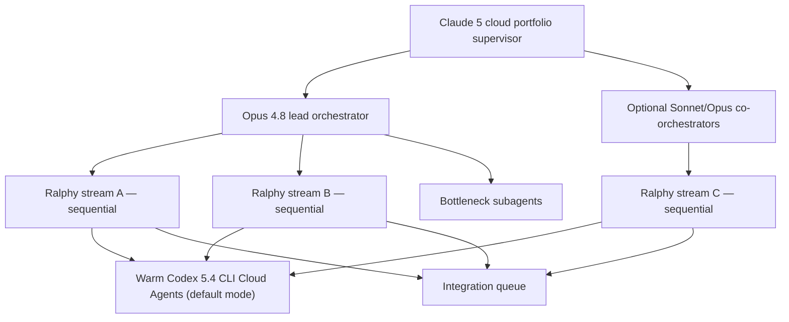
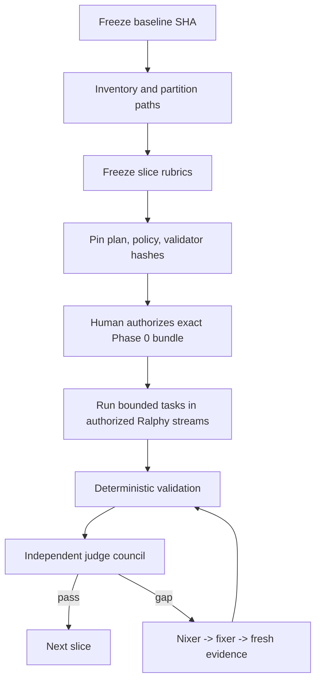

# ContinuityOps Ralphy Orchestration

## 1. Purpose

This is the end-to-end controller for taking a completed but uncertified code
base, partitioning it, repairing bounded gaps, and independently certifying each
partition and the final integrated repository.

The flow combines the strongest elements of the Project A and Project C
examples:

- Project A: sequential-per-stream Ralphy behavior,
  frozen rubrics, hash-bound approvals, multi-judge loops, nixer/fixer repair,
  bottleneck mode, break/fix durability, and clean rejudge;
- Project C: authoritative task state, explicit phase authorization, narrow
  write scopes, independent engineering/change/QA/security/evidence gates,
  append-only issue handling, and strict local-versus-hosted claim boundaries.

## 2. Durable context protocol

Chat history is non-authoritative. The orchestrator re-reads durable artifacts:

- at the beginning of every turn;
- after any handoff;
- before dispatching a worker or judge;
- after every judge round;
- after every hosted CI break/fix cycle;
- after any upstream pin, plan, rubric, policy, or approval change;
- at least once every 30–45 minutes during active execution.

Read order:

1. `AGENTS.md`
2. `PLAN.md`
3. `STATUS.md` / `OPERATING_STATE.md`
4. `ISSUES.md`
5. current frozen slice rubric
6. current task policy and approval hash
7. `BREAK_FIX_LOG.md`
8. upstream lock manifest
9. exact candidate diff and evidence manifest

Discard assumptions that conflict with these files. When a context is long or
stale, start a fresh orchestrator turn and reload this set.

## 3. Supervisory and multi-stream topology



The portfolio supervisor owns the global objective and may appoint cloud-only
Sonnet/Opus co-orchestrators. Claude Opus 4.8 is the default Ralphy
orchestration and council model (D-022). Warm Codex 5.4 CLI Cloud Agents in
default mode (not `/high`, not `/fast`) own implementation with pre-set-up
environments, and report remaining context on every handoff (D-023/D-024). All
worker, supervisor↔orchestrator, and inter-agent communication is Simplified
Chinese; recruiter-facing repository artifacts are English.

Up to three implementation streams may run concurrently by default. Every
stream remains sequential internally. A stream starts only when:

- its partition paths are disjoint from every live stream;
- shared interfaces are frozen and content-addressed;
- its branch/workspace and evidence namespace are isolated;
- its integration order and dependency invalidation are recorded;
- it has an assigned orchestrator and one mutation owner;
- it has an explicit stop condition for shared-interface drift.

The integration queue serializes merges. A completed stream cannot merge itself.
If two streams touch the same interface or authoritative artifact, dependent
streams pause and the lead orchestrator resolves the interface first.

### Cloud-only Claude transport

Claude agents run in cloud environments only. When approved, they may launch
`pxpipe-proxy@0.9.0` and use
`ANTHROPIC_BASE_URL=http://127.0.0.1:47821`. Treat the claimed quota improvement
as an experiment: pin and verify the package, protect credentials/logs, confirm
provider policy, measure token/latency/quality effects, and preserve a direct
fallback. Compressed context never counts as judge evidence.

## 4. Bootstrap flow for completed code



Bootstrap steps:

1. Require a clean branch and record `baseline_sha`.
2. Generate a file inventory and dependency/interface map.
3. Assign every retained code path to exactly one primary slice.
4. Identify shared-interface paths and certify them before dependent slices.
5. Generate `partition-manifest.json` with path list and SHA-256 per slice.
6. Rubric setters inspect the baseline and freeze one rubric per slice.
7. Generate task policies with dependencies, allowed paths, expected artifacts,
   validator IDs, evidence paths, claim ceilings, and human gates.
8. Compute:
   - `plan_bundle_sha256`
   - `execution_bundle_sha256`
   - `validator_implementation_sha256`
   - `rubric_bundle_sha256`
   - `partition_manifest_sha256`
9. Human gate H0 approves the exact bundle.
10. Run harmless smoke tasks proving multi-stream isolation, sequential
    completion inside each stream, fresh-worker replacement, bottleneck
    dispatch, unauthorized-work rejection, and adapter-evidence protection.

## 5. Authoritative task state

Legal lifecycle:

```text
planned -> ready -> running -> blocked | review -> verified -> done
```

Rules:

- only the adapter/orchestrator changes task state;
- a worker can recommend `review` or `blocked`, never `verified` or `done`;
- `ready` requires authorized phase, satisfied dependencies, valid hashes,
  clean candidate state, and any required human receipt;
- `verified` requires deterministic gates plus independent review evidence;
- `done` is applied only after the slice exit gate passes;
- authorization is monotonic only through an explicit human decision;
- the currently authorized phase must pass while the immediately next phase is
  demonstrably rejected by a regression test.

Any authorization change requires fresh narrow and full authorization-boundary
tests before other work.

## 6. Task execution loop

For each ready task:

1. Adapter verifies bundle hashes, task policy, candidate SHA, allowed paths,
   dependency states, claim ceiling, and receipts.
2. Adapter captures a pre-task tree manifest.
3. Orchestrator dispatches a warm Codex 5.4 CLI Cloud Agent (default mode)
   with a fresh Mandarin short contract.
4. The worker implements only within `allowed_paths` and returns the handoff
   schema with Simplified Chinese free-text values.
5. Adapter reconciles modified paths, forbidden operations, isolation dirs,
   secrets, state, and evidence ownership.
6. Run narrow validators first, then the full slice validator set.
7. If pass, create adapter-owned append-only evidence and move task to review.
8. If fail, normalize the error, update attempts, preserve raw evidence, and
   choose one repair pass, a fresh worker, bottleneck subagent, blocker, or
   human gate.
9. After independent task review passes, move task to verified.
10. Commit one logical task change with evidence linkage.

No validator accepts arbitrary task-provided commands. Task policies reference
allowlisted validator IDs whose implementations and arguments are pinned.

## 7. Worker replacement and bottleneck subagents

The initial Codex worker gets one implementation and one repair pass. Dispatch a
fresh replacement worker or specialist bottleneck subagent on the first
applicable condition:

- two same-class failures;
- one repair without a meaningful diff;
- 25 active minutes without verified progress;
- path/scope escape;
- inaccessible authentication, hosted CI, cloud identity, Kubernetes,
  dashboard/observability, browser, or required-tool surface;
- explicit security or policy gate.

The replacement/bottleneck packet contains only:

```yaml
task_id:
goal:
baseline_sha:
candidate_sha:
allowed_paths: []
failing_validator_ids: []
normalized_errors: []
issue_ids: []
current_diff_path:
evidence_paths: []
required_commands: []
claim_ceiling:
```

Available bottleneck profiles include `auth`, `github-actions`, `aws-gitops`,
`kubernetes`, `observability-dashboard`, `toolchain`, and `browser-evidence`.
The lead orchestrator dispatches the specialist in the same supervisory session
instead of asking the user to begin a new conversation. A bottleneck subagent
diagnoses first; mutation requires a separately scoped fixer task. It never
replaces human approval or independent judging.

## 8. Slice freeze and candidate preparation

When all implementation tasks for a slice reach `verified`:

1. run full repository validation;
2. require a clean tree;
3. commit all adapter-owned evidence;
4. record exact `candidate_sha`;
5. recompute partition and execution hashes;
6. build an append-only evidence manifest for that SHA;
7. verify hosted checks required by the slice on that SHA;
8. freeze code mutation during judging;
9. dispatch judges with the frozen rubric, candidate SHA, evidence manifest,
   and claim ceiling only.

Judges may write only to unique paths such as:

```text
evidence/judges/S4/round-02/judge-01.md
evidence/judges/S4/round-02/judge-02.md
evidence/judges/S4/round-02/judge-03.md
```

## 9. Experimental saved-council loop plus fresh validation

ContinuityOps deliberately tests a two-stage judge strategy.

### Stage A — saved remediation council

For each slice, create a named saved cohort:

- two saved judges;
- one or more saved nixers;
- one or more saved fixers;
- one council coordinator.

This cohort remains assigned across repair rounds until it reaches a provisional
pass. Continuity is useful here: saved judges can verify whether their exact
findings were fixed, saved nixers can detect recurrence, and saved fixers retain
local repair context. The cohort records anchoring risk and may not issue final
certification.

Loop:

`saved judges -> saved nixers -> saved fixers -> full validation -> fresh
evidence -> same saved judges`, repeated until provisional must-haves pass and
the saved-cohort mean is at least 9.5.

### Stage B — authoritative fresh council

After provisional pass, retire all saved-cohort context from the validation
packet. Dispatch three fresh judges with only the exact candidate SHA, frozen
rubric, source, and current evidence manifest.

- If all fresh exit rules pass, certify the slice.
- If any fresh judge fails a must-have, scores below the exit rule, or returns
  `merge_ready: no`, the saved repair cohort is not reused.
- Dispatch fresh nixer(s) and fresh fixer(s), create a new candidate SHA, rerun
  all validation/evidence, and then dispatch another entirely fresh judge
  council.
- Repeat until pass or a genuine human gate remains.

Track experimental metrics per slice: remediation rounds, recurring findings,
fresh-judge escape findings, elapsed time, token use where observable, scores,
regressions, and whether saved context created anchoring. The fresh council is
always authoritative.

## 10. Fresh-judge independence controls

- Use three fresh judge contexts.
- Prefer different independent model instances; record actual model IDs.
- Do not fork implementation transcripts into judge contexts.
- Do not provide prior scores, other verdicts, nixer reports, fixer rationale,
  or the numeric exit threshold as a target.
- Judges inspect the same exact committed SHA and evidence manifest.
- Judges do not modify code or communicate with one another.

### Judge output schema

```yaml
slice_id:
round:
candidate_sha:
rubric_sha256:
evidence_manifest_sha256:
judge_model_id:
must_haves:
  - id:
    status: pass|fail|not_proven
    evidence: []
blocking_findings: []
scored_dimensions:
  - id:
    score: 0.0
    rationale:
    evidence: []
unsupported_claims: []
security_findings: []
improvements: []
overall_score: 0.0
merge_ready: yes|no
```

### Slice exit

All conditions are mandatory:

- every must-have is `pass` for every judge;
- mean overall score ≥ 9.5;
- no individual overall score < 9.0;
- all three judges say `merge_ready: yes`;
- deterministic validation and required hosted checks pass on candidate SHA;
- no open critical/high security issue affects the slice;
- evidence and claims review passes;
- required human gate is satisfied.

Nice-to-have gaps do not block unless the frozen rubric says they are required.

## 11. Nixer/fixer loop

If any slice-exit condition fails:

1. Controller marks the round failed without changing the frozen rubric.
2. If the failure came from saved judges, use the saved nixer/fixer cohort. If
   it came from a fresh council, retire the old repair cohort and dispatch fresh
   nixer(s)/fixer(s) with judge reports, rubric, exact SHA, and evidence—but not
   implementation transcript.
3. Nixer deduplicates findings, reproduces them where possible, distinguishes
   symptoms/root causes, assigns severity and issue IDs, identifies exact paths,
   and proposes disjoint repair units.
4. Orchestrator checks proposed changes against plan and claim boundaries.
5. Dispatch fixers sequentially or concurrently only for demonstrably disjoint
   scopes.
6. Each fixer is a bounded Opus 4.8 repair role or dispatches a warm Codex 5.4
   default-mode code executor under the same scope; a failed fresh council
   always gets a fresh repair cohort.
7. After fixes, rerun narrow validation, full slice validation, full repository
   validation, and required hosted checks.
8. Regenerate all candidate-bound evidence after the fix.
9. Append break→root cause→fix→verification to `BREAK_FIX_LOG.md`.
10. Commit a new candidate SHA, repin affected hashes/receipts, and run a fully
    fresh three-judge round.

Earlier judge scores never carry forward after a code, rubric, policy, evidence,
or upstream-pin change.

## 12. Bottleneck mode

Use bottleneck mode only for a narrow reproducible CI/regression blocker.

1. One judge produces an exact checklist with file/line/evidence references.
2. Nixer confirms root cause.
3. Fixer repairs the bounded issue.
4. Full relevant validation runs.
5. Return to the same judge until it independently scores at least 9.0; do not
   tell the judge the threshold.
6. A new independent judge must then score at least 9.0 on first evaluation.
7. Exit bottleneck mode and resume the normal three-judge slice round.

Bottleneck clearance never substitutes for the 9.5 slice certification.

## 13. Round limits and escalation

The orchestrator continues while a deterministic safe next step exists. It does
not stop merely because a judge round failed.

Escalate after:

- three standard judge rounds fail on the same root cause;
- a fresh Codex worker and applicable bottleneck specialist exhaust the bounded
  repair path;
- a required external dependency or service is unavailable with no pinned
  alternative;
- resolution requires new credentials, authority, budget, destructive action,
  scope, or architecture;
- the rubric itself is impossible or internally inconsistent.

Rubric changes after freeze require:

- a reproducible integrity/security/acceptance defect;
- an issue record explaining why code cannot solve it;
- independent rubric review;
- new rubric hash;
- invalidation of earlier slice scores;
- human approval if scope or exit criteria materially change.

## 14. Evidence freshness and reconciliation

After every repair:

- rerun the full approved commands;
- replace no append-only events; add superseding events;
- bind outputs to the new candidate SHA;
- record tool versions, environment, identity, time, exit code, hashes, and
  redactions;
- mark older evidence `superseded`, never silently delete it;
- ensure status, claims, README tense, architecture, runbooks, and evidence
  agree on what is designed, validated, applied, recovered, or torn down.

The adapter performs completion reconciliation after the worker exits, so paths
or isolation directories created late cannot evade policy checks.

## 15. Hosted CI and cloud control plane

The preferred control plane is GitHub Actions OIDC using short-lived credentials
and protected environments.

Hosted workflow order:

1. PR: static tests, security checks, Terraform/Helm plan/render, claim/evidence
   schema checks, no cloud mutation.
2. Main/manual: protected staging apply using OIDC.
3. Recovery-lab: separately protected destructive drill using OIDC plus human
   receipt.
4. Evidence: capture identity, commit, plan/apply/drill outputs, resource
   inventory, and post-checks.
5. Teardown: separate protected job with inventory and evidence preservation.

Do not switch to a Cloud Agent login merely because it exists. If credentials
are missing in the current execution environment, diagnose control-plane
mismatch early and use the authorized hosted path. Fail fast with an explicit
message rather than retrying opaque `NoCredentials` errors.

## 16. TypeScript 7 contract

Any TypeScript code uses a pinned stable TypeScript 7.x compiler. The initial
verified registry baseline for this plan is `typescript@7.0.2` as of
2026-07-14. Enable strict checking, record compiler/runtime compatibility, and
route upgrades through dependency review, CI, and all affected partition judge
loops. Do not silently fall back to TypeScript 6 or a mutable `next` tag.

## 17. Safe blocked-change demonstrations

Each major control includes a harmless negative test:

- formatting/lint failure blocks PR;
- unpinned image/tag blocks Kubernetes release;
- missing required tag/naming policy blocks Terraform;
- excessive IAM/RBAC permission is rejected;
- network policy denies unauthorized path;
- agent-proposed unsafe command is rejected;
- unauthorized environment approval cannot deploy;
- stale/forged evidence cannot satisfy a gate;
- rollback without a known-good target is rejected;
- phase N+1 cannot start while authorization stops at N.

Negative demonstrations use isolated branches, fixtures, or lab environments
and never risk customer/shared systems.

## 18. Post-build logical repartition

When implementation is feature-complete, do not reuse only the construction
partitions. Re-audit the final dependency graph and logically repartition the
entire codebase by operational capability and shared interface. Freeze a new
`postbuild-partition-manifest.json` without changing code merely to fit the
partition map.

Every final partition runs the saved-remediation-council experiment followed by
an authoritative fresh council. Cross-partition interfaces receive their own
integration rubric. Any fresh failure receives fresh nixers/fixers and a new
fresh council. Only after all post-build partitions pass may S8 begin.

## 19. Recruiter front-page gate

The repository root README must be resume-ready and recruiter-scannable in
under 60 seconds. It begins with one polished landscape infographic generated
from the exact draw.io architecture source, followed by outcome, verified
capabilities, architecture, evidence links, incident/recovery results, metrics,
technology, honest boundaries, and a five-minute demo path.

Required assets:

- editable `docs/architecture/continuityops.drawio`;
- exact diagram render used as the Image2 reference;
- one polished 16:9 PNG infographic;
- alt text and compact architecture description;
- evidence-linked claim footer distinguishing synthetic lab proof from
  sustained customer production operations.

Visuals never introduce services, stages, metrics, or claims absent from the
final evidence index.

## 20. Final clean-room rejudge

After every slice passes:

1. start a new orchestrator turn;
2. load durable artifacts only;
3. confirm no uncommitted changes;
4. run complete deterministic and hosted validation on final SHA;
5. regenerate integrated evidence and claims matrices;
6. dispatch three clean-room judges with only final source, frozen integrated
   rubric, exact SHA, and evidence manifest;
7. require all final exit conditions;
8. run nixer/fixer/full revalidation/fresh council until pass or a true human
   gate remains;
9. append the final process record and any deviations;
10. request human H6 approval for merge/publication.

The final report must disclose process deviations, simulated components,
unexecuted environments, and claims that remain unavailable.
